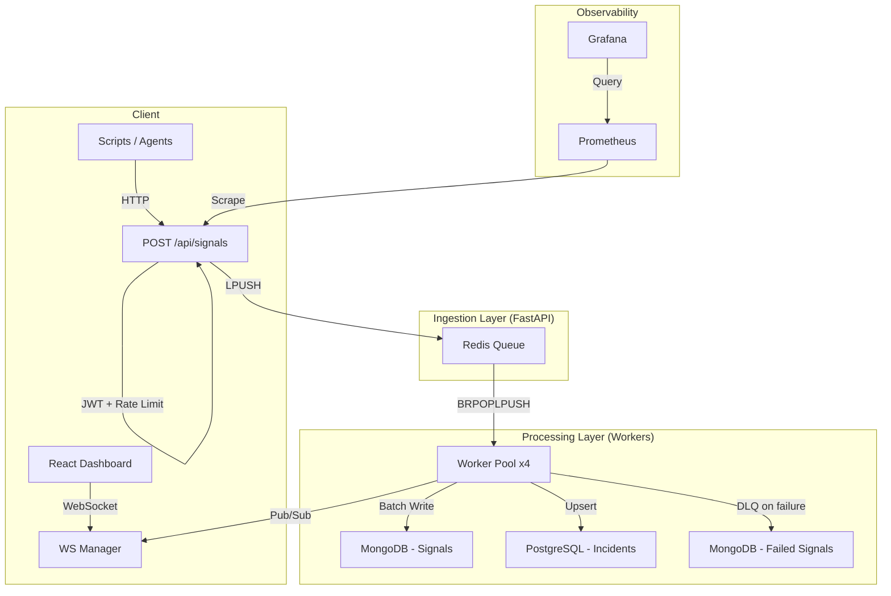

# 🛡️ Zetatop: Production-Grade Incident Management System

[](https://sre.google/)
[](https://groq.com/)
[]()
[]()
[](https://github.com/Sanvith6/zea/actions)

---

## 1. Project Overview

Zetatop is a high-availability **Incident Management System (IMS)** built for SRE environments that generate massive volumes of monitoring signals during failures.

### Problem
A single database outage can produce **10,000+ error signals** in seconds. Without intelligent deduplication, each signal creates a separate alert, overwhelming on-call engineers with noise and obscuring the actual incident.

### Solution
Zetatop implements a **decoupled Producer-Consumer architecture** that:
- Accepts signals at **10,000+/sec** without blocking (Redis LPUSH in <10ms)
- **Debounces** hundreds of signals into a single actionable incident (99%+ noise reduction)
- Provides **AI-powered Root Cause Analysis** via Groq (Llama 3.3 70B)
- Enforces a **strict incident lifecycle** with mandatory RCA before closure
- Maintains **full observability** through Prometheus/Grafana integration

---

## 2. Architecture Summary

The system follows a five-layer architecture where each layer is independently scalable and failure-isolated:

```
Signal Source → POST /api/signals
    ↓
[1] JWT Auth + Rate Limiting (10k/sec per IP)
    ↓
[2] Adaptive Throttling (429 at 70% queue capacity)
    ↓
[3] Redis Queue (LPUSH — sub-millisecond, AOF-persistent)
    ↓
[4] Worker Pool (BRPOPLPUSH — crash-safe dequeue)
    ↓
[5a] MongoDB (raw signal storage — idempotent upsert)
[5b] PostgreSQL (incident management — ACID transactions)
    ↓
[6] Redis Pub/Sub → WebSocket → React Dashboard (real-time)
```

**Key Insight**: The API never writes to PostgreSQL or MongoDB directly. All database operations happen asynchronously in the worker pool, meaning **database outages never crash the ingestion API**.

---

## 3. Architecture Diagram



---

## 4. Setup Instructions

### Quick Start

```bash
# Clone and start all services
docker-compose up --build

# Generate sample incidents (in a separate terminal)
python scripts/simulate_failure.py
python scripts/simulate_failure2.py
python scripts/simulate_failure3.py
```

### Service URLs

| Service | URL | Credentials |
|---------|-----|-------------|
| **Frontend Dashboard** | http://localhost:3001 | `sre-intern` / `zeotap-local` |
| **Backend API** | http://localhost:8000 | JWT Bearer token |
| **Prometheus** | http://localhost:9090 | — |
| **Grafana** | http://localhost:3002 | `admin` / `admin` |
| **Health Check** | http://localhost:8000/health | — |
| **Readiness Check** | http://localhost:8000/ready | — |
| **Prometheus Metrics** | http://localhost:8000/metrics | — |

### Environment Variables

The system reads configuration directly from `.env.example`. No additional setup is needed for core features.

**To enable AI-Powered RCA Suggestions:**

1. Get a free API key at [console.groq.com/keys](https://console.groq.com/keys)
2. Open `.env.example` and replace line 16:
   ```
   GROQ_API_KEY=your_groq_api_key_here   ← replace with your real key
   ```
3. Restart services: `docker-compose up --build`

> **Note**: The system works **fully without a Groq API key**. All core features (signal ingestion, debouncing, state machine, MTTR, observability) function without it. The AI RCA suggestion button will return a graceful fallback response. To enable AI-powered RCA, simply add a free Groq API key as shown above.

| Variable | Default | Purpose |
|----------|---------|---------|
| `GROQ_API_KEY` | `your_groq_api_key_here` | AI-powered RCA suggestions — free at [console.groq.com](https://console.groq.com/keys) |
| `QUEUE_MAX_SIZE` | 10000 | Maximum signals in Redis queue |
| `RATE_LIMIT` | 10000/second | Per-IP rate limit |
| `CB_FAILURE_THRESHOLD` | 5 | Circuit breaker trip threshold |
| `WORKER_CONCURRENCY` | 4 | Number of concurrent workers |

### Health Check

```bash
curl http://localhost:8000/ready
```

```json
{
  "status": "ready",
  "uptime": 3600,
  "queue_depth": 0,
  "dependencies": {"postgres": "ok", "mongo": "ok", "redis": "ok"}
}
```

---

## 5. Key Features (Mapped to Assignment Requirements)

### 5.1 High-Throughput Ingestion (10k+/sec)

**File**: `backend/app/routers/signals.py`, `backend/app/services/queue.py`

- Signals are validated (Pydantic) and pushed to Redis via LPUSH in <10ms
- API returns `202 Accepted` immediately — processing happens asynchronously
- Rate limited at 10,000/second per IP via `slowapi`

### 5.2 Debouncing Logic

**File**: `backend/app/services/ingestion.py:191-258`

- Redis Sorted Sets track signals per component in a 10-second sliding window
- After 100 signals for the same component, ONE incident is created
- Subsequent signals increment the existing incident's `signal_count`
- Cache-first lookup (`debounce:{component_id}`) avoids PostgreSQL queries during bursts

**Result**: 150 signals → 1 incident = **99.3% noise reduction**

### 5.3 Async Processing Pipeline

**File**: `backend/app/services/ingestion.py:63-100`

- Workers use `BatchBuffer` (500 signals or 1s timeout)
- MongoDB `bulk_write` reduces round-trips
- Redis pipeline for bulk acknowledgment
- Full `async/await` stack: `asyncpg`, `motor`, `redis.asyncio`

### 5.4 RCA Enforcement

**File**: `backend/app/services/state_machine.py:55-64`

- The `ResolvedState` checks `has_complete_rca()` before allowing CLOSED transition
- All 5 RCA fields must be non-empty: `incident_start`, `incident_end`, `root_cause_category`, `fix_applied`, `prevention_steps`
- Incomplete RCA → `InvalidTransitionError` → HTTP 409

### 5.5 MTTR Calculation

**File**: `backend/app/services/workitems.py:137-138`

```python
mttr_minutes = (incident_end - incident_start).total_seconds() / 60
```

Calculated on RCA submission and stored on the Work Item. Displayed on the dashboard and in analytics.

### 5.6 Workflow State Transitions

**File**: `backend/app/services/state_machine.py`

GoF State Pattern with strict forward-only progression:

```
OPEN → INVESTIGATING → RESOLVED → CLOSED (requires RCA)
```

- Invalid transitions raise `InvalidTransitionError`
- Same-state transitions are idempotent (no-op)
- Every transition creates an audit trail record in `WorkItemStatusHistory`

---

## 6. Backpressure Strategy

**Files**: `backend/app/routers/signals.py`, `backend/app/services/queue.py`

| Queue Capacity | System Response | HTTP Code |
|---------------|----------------|-----------|
| 0–50% | Normal operation | 202 |
| 50–70% | Warning logs emitted | 202 |
| 70–99% | Adaptive throttling active | **429** + `Retry-After: 5` |
| 100% | Hard rejection | **503** |

Redis is configured with `maxmemory-policy noeviction` — it will never silently drop queued signals. See [BACKPRESSURE.md](docs/BACKPRESSURE.md) for the full deep-dive.

---

## 7. Observability

### Health Endpoints
- `GET /health` — Liveness (uptime)
- `GET /ready` — Readiness (PostgreSQL + MongoDB + Redis connectivity)
- `GET /metrics` — Prometheus-format metrics

### Prometheus Metrics (12 custom metrics)

| Metric | Type | Purpose |
|--------|------|---------|
| `ims_signals_ingested_total` | Counter | Total signals accepted |
| `ims_signals_processed_total` | Counter | Total signals processed by workers |
| `ims_signals_failed_total` | Counter | Signals sent to DLQ |
| `ims_queue_depth` | Gauge | Current Redis queue depth |
| `ims_processing_rate_per_second` | Gauge | Real-time processing rate |
| `ims_signal_processing_seconds` | Histogram | End-to-end processing latency |
| `ims_signal_queue_wait_seconds` | Histogram | Time signals wait in queue |
| `ims_circuit_breaker_state` | Gauge | Per-dependency breaker state |
| `ims_retry_total` | Counter | Processing retry count |
| `ims_db_write_latency_seconds` | Histogram | Database write latency |
| `ims_ai_rca_requests_total` | Counter | AI RCA request count |

### Structured Logs (every 5 seconds)
```
[METRICS] Rate: 150 sig/s | Queue: 0 | Active incidents: 3 | Avg MTTR: 22 min | Latency p50=0.025s p95=0.110s p99=0.250s
```

---

## 8. Non-Functional Enhancements

### Rate Limiting
- 10,000 requests/second per IP via `slowapi` + Redis backend
- Configurable via `RATE_LIMIT` environment variable

### Retry Logic
- PostgreSQL writes: 3 attempts with exponential backoff (150ms, 300ms)
- Only transient errors (`OperationalError`, `DBAPIError`) are retried
- Each retry is recorded as a Prometheus metric

### Fault Tolerance
- **Circuit Breaker**: Per-dependency (PostgreSQL, MongoDB) with distributed Redis state
- **Dead Letter Queue**: Failed signals preserved in MongoDB `failed_signals` collection
- **Crash Recovery**: `BRPOPLPUSH` pattern recovers stranded signals on worker restart

### WebSockets
- Real-time incident updates via `/ws/incidents` endpoint
- Redis Pub/Sub bridges worker events to connected dashboard clients
- Automatic fallback to polling if WebSocket disconnects

### Severity Auto-Classification
- **File**: `backend/app/services/classifier.py`
- Rule-based severity upgrade based on component blast radius
- RDBMS/MCP → P0 baseline, API/Queue → P1, Cache/NoSQL → P2
- Never downgrades — producer may have additional context

### Alert Strategy Pattern
- **File**: `backend/app/services/alerts.py`
- Component-specific escalation policies (P0 page, P1 incident, P2 warning)
- Webhook-based dispatch to mock endpoint (replaceable with PagerDuty/Slack)

---

## 9. Testing

```bash
pytest backend/tests
# 40 passed in ~5s
```

### Test Coverage

| Suite | Tests | What's Covered |
|-------|-------|----------------|
| State Machine | 12 | Valid transitions, invalid blocking, RCA enforcement, idempotency |
| Signal Ingestion | 8 | Payload validation, enum validation, timestamp normalization |
| API Integration | 12 | All endpoints, auth, error handling |
| Circuit Breaker | 4 | State transitions, recovery, distributed coordination |
| Debouncing | 4 | Window management, threshold, deduplication |

---

## 10. Engineering Tradeoffs

| Decision | Chosen | Alternative | Why |
|----------|--------|-------------|-----|
| Message Broker | Redis | Kafka | Sub-ms latency, simpler operations at our scale |
| Dashboard Updates | WebSockets | Polling | 150ms vs 5s latency, lower server load |
| Signal Store | MongoDB | InfluxDB | Schema-flexible events, bulk_write at 10k/sec |
| Source of Truth | PostgreSQL | MongoDB | ACID compliance for state transitions and RCA |
| AI Model | Llama 3.3 (Groq) | GPT-4 | Sub-second inference, structured JSON output |

---

## 📂 Documentation Index

| Document | Description |
|----------|-------------|
| [SYSTEM_DESIGN.md](docs/SYSTEM_DESIGN.md) | Tech stack choices, tradeoffs, scaling strategy |
| [WORKFLOW.md](docs/WORKFLOW.md) | State machine, transition validation, audit trail |
| [RCA_FLOW.md](docs/RCA_FLOW.md) | RCA enforcement, MTTR calculation, AI integration |
| [API_DOCS.md](docs/API_DOCS.md) | All API endpoints with request/response examples |
| [BACKPRESSURE.md](docs/BACKPRESSURE.md) | Four-tier backpressure strategy deep-dive |
| [SAMPLE_DATA.md](docs/SAMPLE_DATA.md) | Simulation scripts and sample payloads |
| [PROMPTS.md](docs/PROMPTS.md) | Design thinking and iterative improvements |
| [FINAL_SUBMISSION_CONTENT.md](docs/FINAL_SUBMISSION_CONTENT.md) | PDF submission content |
| [LOAD_TEST_RESULTS.md](docs/LOAD_TEST_RESULTS.md) | Load test results with real numbers |
| [ARCHITECTURE.md](docs/ARCHITECTURE.md) | System architecture reference |

---

## 🚀 Future Roadmap

- **Kafka Integration**: Partitioned message streams for planetary-scale ingestion
- **Cross-Region Replication**: Survive entire data-center outages
- **ML Anomaly Detection**: Auto-adjust debounce thresholds from historical patterns
- **PagerDuty/Slack Integration**: Replace mock alerts with production alerting
