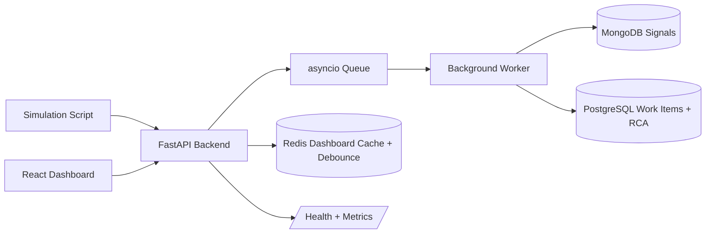

# Incident Management System

Production-ready Incident Management System built with FastAPI, React, PostgreSQL, MongoDB, Redis, and Docker Compose.

## Architecture



## Tech Stack

| Layer | Choice | Why |
| --- | --- | --- |
| Backend | FastAPI async | High-throughput ingestion, Pydantic validation, simple OpenAPI |
| Frontend | React + Vite | Fast development server, production-ready SPA structure |
| SQL | PostgreSQL | Durable relational state for work items and RCA records |
| NoSQL | MongoDB | Flexible raw signal log storage |
| Cache | Redis | Short-lived dashboard cache and debounce window storage |
| Queue | In-process asyncio queue | Fast backpressure boundary without external broker complexity |
| Containers | Docker Compose | One-command local deployment |

## Setup

```bash
docker-compose up
```

For a fresh rebuild after code changes:

```bash
docker-compose up --build
```

Open:

| Service | URL |
| --- | --- |
| Frontend | http://localhost:3000 |
| Backend API | http://localhost:8000 |
| Health | http://localhost:8000/health |
| Readiness | http://localhost:8000/ready |
| Metrics | http://localhost:8000/metrics |

No manual database migrations are required; the backend creates PostgreSQL tables and MongoDB indexes during startup.

## Backpressure

`POST /api/signals` validates the signal and calls `put_nowait` on an in-memory `asyncio.Queue`, then immediately returns `202 Accepted`. A background worker consumes the queue, writes raw signals to MongoDB, applies debounce rules, creates or updates PostgreSQL work items, and links MongoDB signals to the work item. If the queue reaches its configured maximum size, the API returns `503` so callers can retry instead of blocking the event loop.

## SRE Focus

This system is designed around incident operations rather than only ticket storage:

| SRE Concern | Implementation |
| --- | --- |
| Fast ingestion during outages | API acknowledges validated signals with `202` and moves processing to an async queue |
| Backpressure | Bounded queue returns `503` when saturated so upstream systems retry instead of timing out the service |
| Alert noise reduction | 100+ signals for the same component in 10 seconds create one incident, with all raw evidence linked |
| Incident deduplication | Existing non-closed work items are reused for the same component |
| Operational visibility | `/health`, `/ready`, `/metrics`, and 5-second structured metrics logs |
| Dependency readiness | `/ready` verifies PostgreSQL, MongoDB, and Redis before Compose marks the backend healthy |
| MTTR tracking | RCA submission calculates and stores MTTR for incident review |
| Closure control | State machine blocks `CLOSED` unless RCA fields are complete |
| Recovery safety | PostgreSQL writes retry transient failures with exponential backoff |

### Suggested SLOs

| User Journey | Target |
| --- | --- |
| Signal ingestion availability | 99.9% while dependencies are healthy |
| Ingestion acknowledgement latency | p95 under 100 ms for accepted requests |
| Dashboard freshness | Active incident list refreshed or cached within 10 seconds |
| Incident creation delay | Work item created within 10 seconds after debounce threshold is crossed |
| RCA completeness | 100% of closed incidents require RCA and MTTR |

### Operational Runbook

| Symptom | Check | Action |
| --- | --- | --- |
| Backend container unhealthy | `curl http://localhost:8000/ready` | Inspect which dependency failed, then check `docker-compose logs postgres mongo redis backend` |
| Dashboard is stale | `curl http://localhost:8000/api/workitems` and Redis logs | Wait for 10s cache TTL or clear `dashboard:workitems` |
| Signals return `503` | `/metrics` queue depth | Treat as backpressure, scale worker design or reduce producer rate |
| Too many duplicate alerts | Work item list and Mongo linked signals | Confirm component IDs are stable and debounce window is receiving related signals |
| Incident cannot close | Work item RCA tab | Submit complete RCA with start/end, category, fix, and prevention steps |

## API Reference

| Method | Path | Purpose |
| --- | --- | --- |
| POST | `/api/signals` | Ingest signal, rate-limited to 500 requests/sec/IP |
| GET | `/api/workitems` | List active work items sorted by severity, cached in Redis for 10s |
| GET | `/api/workitems/{id}` | Work item detail with linked MongoDB signals and timeline |
| PATCH | `/api/workitems/{id}/transition` | Atomic status transition |
| POST | `/api/workitems/{id}/rca` | Submit RCA and calculate MTTR |
| GET | `/health` | Service status and uptime |
| GET | `/ready` | Dependency readiness and queue depth |
| GET | `/metrics` | Prometheus-compatible metrics |

## Simulation

With the stack running:

```bash
python -m pip install httpx
python scripts/simulate_failure.py
```

The script sends 150 RDBMS P0 signals over 8 seconds, 80 MCP P0 signals over 5 seconds, then 30 random cache/queue P2/P3 signals.

## Design Patterns

| Pattern | Location | Purpose |
| --- | --- | --- |
| Strategy | `backend/app/services/alerts.py` | Maps component types to alert behavior without branching through the worker |
| State | `backend/app/services/state_machine.py` | Enforces `OPEN -> INVESTIGATING -> RESOLVED -> CLOSED` and blocks closing without RCA |

## Non-Functional Features

| Feature | Implementation |
| --- | --- |
| Rate limiting | `slowapi` on signal ingestion |
| Retry logic | PostgreSQL write helper retries transient DB errors up to 3 times with exponential backoff |
| Redis caching | Dashboard work item list cached at `dashboard:workitems` for 10 seconds |
| Debounce | Component-level debounce uses in-memory windows plus Redis `debounce:{component_id}` TTL |
| Health | `/health` reports status and uptime |
| Readiness | `/ready` checks PostgreSQL, MongoDB, Redis, and queue depth for container health |
| Metrics | Background log line every 5 seconds plus `/metrics` endpoint |
| Dark mode | Frontend toggle persisted in local storage |

## Environment

Runtime settings are read from environment variables. See `backend/.env.example` for local override names. Compose provides production defaults for the local stack.

## Assignment Submission Notes

- Push this repository to GitHub and include the repository URL in the final PDF.
- Name the PDF as: `Sanvith - Infrastructure / SRE Intern Assignment.pdf`.
- Include the setup command, architecture summary, implemented bonus/non-functional features, and screenshots or terminal output showing the running app and simulation.
