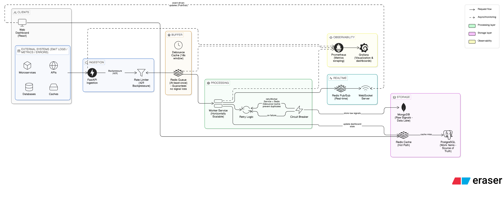

# Zeatop Architectural Deep-Dive

This document provides a Staff-Engineer level breakdown of the Zeatop Incident Management System, mapping the implementation to the mission-critical requirements defined in the [Engineering Assignment](../Engineering_Assignment__Incident_Management_System.pdf).

---

## 1. Ingestion & Burst Resilience (The Producer)

The system is designed to handle **10,000 signals/second** without impacting service availability. This is achieved through three layers of backpressure management:

*   **Rate Limiting**: Per-IP throttling via `slowapi` prevents malicious or runaway producers from saturating the API.
*   **Adaptive Throttling**: The API monitors the Redis queue depth. At **70% capacity**, it triggers a `429 Too Many Requests` with a `Retry-After` header, signaling producers to slow down before a total system failure.
*   **Async Decoupling**: The API does zero database I/O during ingestion. It performs a sub-10ms `LPUSH` to Redis and returns a `202 Accepted` immediately.

## 2. Intelligence & Noise Reduction (The Buffer)

A naive system would create 10,000 incidents for 10,000 signals. Zeatop implements **Distributed Debouncing**:

*   **10s Sliding Window**: Signals for the same `component_id` are grouped within a 10-second sliding window in Redis.
*   **Threshold Trigger**: Only after 100 signals arrive (or a manual override) is a formal **Work Item** created in PostgreSQL.
*   **NoSQL Linking**: All 10,000 raw signals are linked to that single Work Item in MongoDB, providing a complete audit trail without cluttering the operational database.

## 3. Polyglot Storage Strategy (The Persistence)

Zeatop uses the **"Right Tool for the Right Data"** philosophy:

*   **MongoDB (The Data Lake)**: Handles high-volume, unstructured error payloads. Used for the "Raw Signals" audit log.
*   **PostgreSQL (Source of Truth)**: Manages Work Items, State Transitions, and RCA records. Every status update is wrapped in an **ACID transaction**.
*   **Redis (The Hot-Path)**: 
    *   **Durable Queue**: Acts as the ingestion buffer.
    *   **Debounce Cache**: Prevents duplicate DB lookups during signal bursts.
    *   **Pub/Sub**: Powers real-time WebSocket updates for the UI.

## 4. Resilience Patterns (The Workflow Engine)

The system is "Safe-by-Design," implementing several mission-critical patterns:

*   **Circuit Breaker**: MongoDB and PostgreSQL connections are wrapped in a **Circuit Breaker**. If a database becomes slow or unresponsive, the worker "fails fast" and stops attempting writes, preventing a cascading failure of the worker pool.
*   **State Pattern**: The incident lifecycle (`OPEN` → `INVESTIGATING` → `RESOLVED` → `CLOSED`) is managed by a strict **State Machine**. Transitions are validated against business rules (e.g., Cannot close without an RCA).
*   **Strategy Pattern**: Alerting logic is decoupled. The system automatically swaps between `P0_AlertStrategy` (for RDBMS) and `P2_AlertStrategy` (for Caches) based on component classification.
*   **At-Least-Once Delivery**: Using the `BRPOPLPUSH` pattern, signals are never "popped" and lost. They are atomically moved to a "Processing" list and only removed once successfully persisted.

## 5. Observability (The Golden Signals)

Monitoring is built-in, not bolted-on:
*   **Throughput**: `ims_signals_ingested_total` vs `ims_signals_processed_total`.
*   **Latency**: End-to-end processing time tracked in Prometheus Histograms.
*   **Saturation**: Real-time monitoring of Redis queue depth.
*   **Errors**: Dedicated counters for DLQ (Dead Letter Queue) entries and circuit breaker trips.
