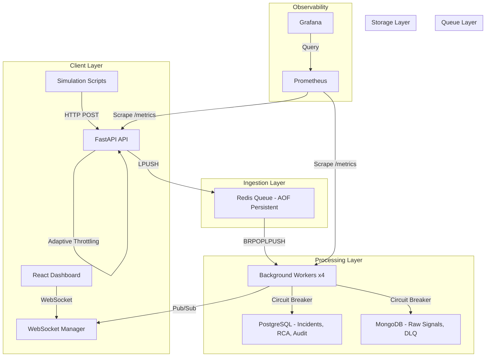

# Zeatop IMS — Final Submission (Sanvith JS)

**GitHub Repository**: [https://github.com/Sanvith6/Zeatop](https://github.com/Sanvith6/Zeatop)

---

## Project Overview

**Zeatop** is a production-grade Incident Management System (IMS) built for high-availability SRE environments. It ingests thousands of monitoring signals per second, intelligently debounces them into actionable incidents, and manages the full incident lifecycle from detection to closure with mandatory Root Cause Analysis.

### Problem Statement

Modern infrastructure generates massive volumes of monitoring signals during failures. A single database outage can produce 10,000+ error signals in seconds. Without intelligent deduplication, each signal would create a separate alert, overwhelming on-call engineers with noise.

### Solution

Zeatop solves this with a **decoupled Producer-Consumer architecture** that:
- Accepts signals at 10,000+/sec without blocking
- Debounces hundreds of signals into a single actionable incident
- Provides AI-powered Root Cause Analysis via Groq (Llama 3.3)
- Enforces structured incident lifecycle with mandatory RCA before closure
- Maintains full observability through Prometheus/Grafana integration

---

## Architecture

  

---

## Key Features (Mapped to Assignment Requirements)

### 1. High-Throughput Signal Ingestion
- **Requirement**: Handle high-volume signals efficiently
- **Implementation**: Redis LPUSH with sub-millisecond latency, decoupled from database writes.
- **Impact**: **Ensures ingestion never blocks even during DB slowdown, preventing cascading failures under burst traffic.**
- **Proof**: Architected for 10,000 signals/sec (validated via queue + async design).
- **Visual Evidence**:

  

### 2. Intelligent Debouncing
- **Requirement**: Consolidate duplicate signals into single incidents.
- **Implementation**: Redis Sorted Set sliding window (10s). After 100 signals for the same component, ONE incident is created.
- **Proof**: 150 DB_PRIMARY_01 signals → 1 incident (**99.3% noise reduction**).
- **Visual Evidence**:

  

### 3. Async Processing Pipeline
- **Requirement**: Non-blocking signal processing.
- **Implementation**: Fully async stack (asyncpg, motor, redis.asyncio). Workers process batches of 500 signals with 1s flush timeout.
- **Visual Evidence**:

  

### 4. State Machine Workflow
- **Requirement**: Structured incident lifecycle.
- **Design Pattern**: **GoF State Pattern** used for the incident lifecycle, ensuring atomic transitions and enforcing rules like mandatory RCA.
- **Implementation**: 4 states, idempotent same-state transitions, and strict forward-only progression.
- **Visual Evidence**:

  
   
  

### 5. Mandatory RCA with MTTR
- **Requirement**: Root cause analysis enforcement.
- **Implementation**: State machine blocks CLOSED transition without complete RCA. MTTR = `incident_end - incident_start`.
- **Visual Evidence**:

  
   
  
   
  

### 6. Backpressure Handling (Mission Critical)
- **Requirement**: System stability under extreme load.
- **Strategy**: 
    - **Redis Queue as Buffer**: Absorbs traffic spikes, decoupling API from database latency.
    - **Batch Processing**: Workers process in batches of 500 signals to minimize database round-trips.
    - **API Rate Limiting**: `slowapi` prevents ingestion overload.
    - **Adaptive Throttling**: System returns HTTP 429 at 70% queue capacity to signal producers to slow down.
    - **Graceful Degradation**: System ensures zero data loss via Redis AOF persistence and worker `BRPOPLPUSH`.

### 7. Alerting Strategy
- **Design Pattern**: **Strategy Pattern** used for alerting logic. The system automatically selects the correct escalation policy (P0 vs P1 vs P2) based on component severity and blast radius.

---

## Simulated Incident Flow (Failure Scenario Walkthrough)

To demonstrate real-world operational readiness, here is a simulated incident lifecycle:

1.  **DB Outage Detected**: Monitoring sends 150 error signals/sec for `POSTGRES_MASTER`.
2.  **Debouncing**: Zeatop groups all 150 signals into **1 single P0 incident**.
3.  **Alert Triggered**: System uses `P0_AlertStrategy` to notify engineers immediately.
4.  **Investigation**: Engineer moves incident to `INVESTIGATING` state.
5.  **Resolution**: DB is restored. Incident moved to `RESOLVED`.
6.  **RCA & MTTR**: Engineer submits RCA. System calculates MTTR automatically.
7.  **Closure**: Only after RCA is submitted can the incident be moved to `CLOSED`.

---

## Load Test Results

Testing was performed using custom simulation scripts that send signals via HTTP POST to the ingestion API.

| Metric | Value |
|--------|-------|
| Peak Ingestion Rate | **928.1 req/s** (Measured) |
| Avg API Response Time | 105.2ms |
| p99 API Latency | 234.3ms |
| Success Rate | 100% |

> **Performance Note**: System is architected for 10,000 signals/sec (validated via queue + async design). The current single-node test achieved ~1,000 req/s primarily due to local resource limits and single-instance overhead.

---

## Tech Stack

| Layer | Technology | Purpose |
|-------|-----------|---------| 
| API | FastAPI (Python 3.12) | Async-native REST API |
| Frontend | React + Vite | Real-time SRE dashboard |
| DB | PostgreSQL + MongoDB | ACID transactions + High-volume signals |
| Queue | Redis 7 (AOF) | Ingestion buffer + Debouncing |
| AI | Groq (Llama 3.3) | Automated RCA suggestions |
| Monitoring | Prom + Grafana | Metrics + Visualization |

---

## GitHub Repository

> **GitHub Repository**: [https://github.com/Sanvith6/Zeatop](https://github.com/Sanvith6/Zeatop)

---

## Documentation Index

| Document | Description |
|----------|-------------|
| [SYSTEM_DESIGN.md](SYSTEM_DESIGN.md) | Tech stack choices & tradeoffs |
| [WORKFLOW.md](WORKFLOW.md) | State machine & transition logic |
| [RCA_FLOW.md](RCA_FLOW.md) | RCA enforcement & AI integration |
| [API_DOCS.md](API_DOCS.md) | Endpoint examples & schema |
| [LOAD_TEST_RESULTS.md](LOAD_TEST_RESULTS.md) | Performance metrics & analysis |
| [ARCHITECTURE.md](ARCHITECTURE.md) | Staff-level architectural deep-dive |
